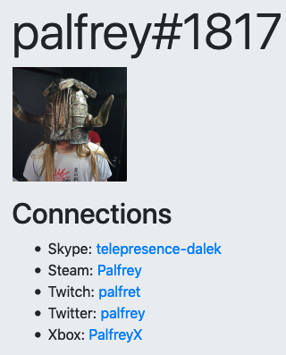

Strife
======

Strife is a little app for displaying [Discord](https://discordapp.com/) profiles, along with their associated links.

FAQ
---
- Why can't I search for users? - Because they need to explicitly opt-in so we've got access to their connections data, and so we setup a specific GUID-based URL for them. In theory, I could add search, but I won't as I prefer allowing users to decide whether to share this data or not themselves.

Local setup
-----------
1. Copy `.env.example` to `.env` and change the following:
    - `DISCORD_CLIENT_ID/SECRET` - Add the credentials you've registered at [Discord Developer Portal](https://discordapp.com/developers/applications/) for a new applications
    - `SECRET_KEY` - follow instructions at https://flask.palletsprojects.com/en/1.0.x/config/#SECRET_KEY about good values for this

2. `flask db upgrade` to setup the database
3. `OAUTHLIB_INSECURE_TRANSPORT=1 FLASK_DEBUG=1 flask run` to run the app
4. Goto http://localhost:5000/

[Wharf](https://github.com/palfrey/wharf) setup
----------------------------------------------------------------
1. Add new app called 'Strife'
2. Add a new Postgres database
3. Set the following environment variables:
    - `GITHUB_URL`: https://github.com/palfrey/strife.git
    - `SECRET_KEY`: as per [instructions for local setup](https://flask.palletsprojects.com/en/1.0.x/config/#SECRET_KEY)
4. Deploy!
